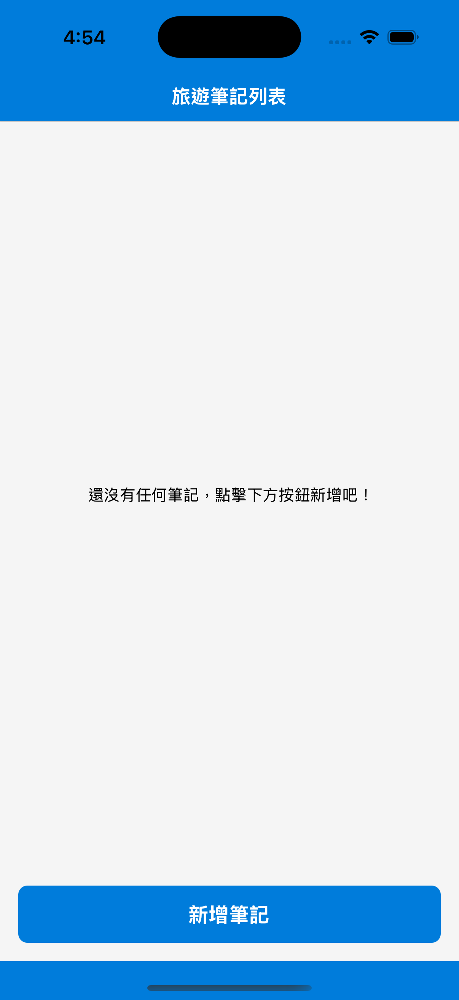
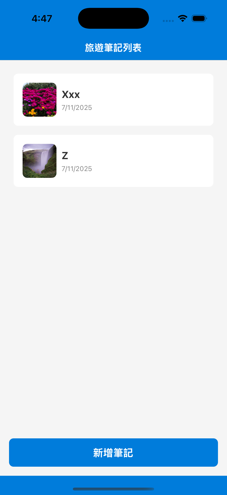
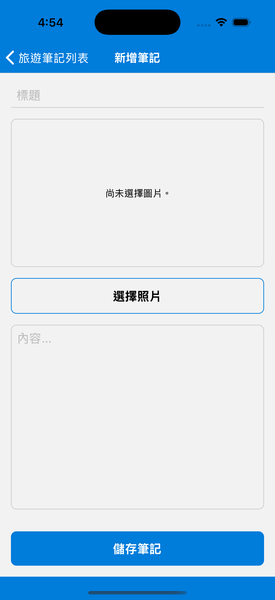
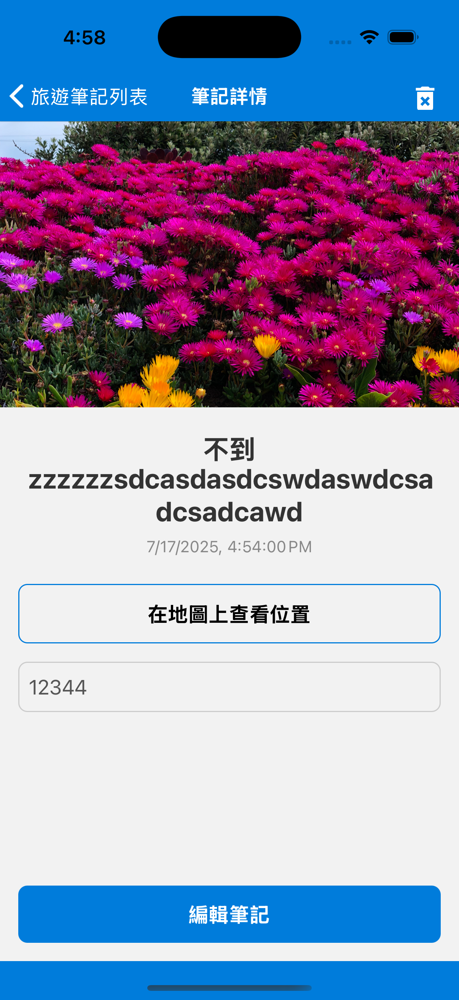

# 第 3 週目標：實作完整多頁作品
## 🎯 DEMO：旅遊筆記 App（含圖片、詳細頁）
使用者可新增地點、心得與圖片，並在清單與詳情頁瀏覽。

## 📌 學習重點：
* 使用 ImagePicker（或 Expo ImagePicker）
* 複雜物件資料儲存 AsyncStorage（含 base64 圖片）
* 多頁面切換（List 頁、Add 頁、Detail 頁）
* Props 傳遞、畫面參數傳遞（React Navigation 的 route.params）

## ✅ 任務實作：
* 📒 主要頁：所有筆記列表（地點 + 照片縮圖）
  * > 
  * > 
* ➕ 新增頁：輸入地點、心得與選擇照片，儲存資料
  * > 
* 🔍 詳細頁：顯示完整筆記內容與照片，可選擇刪除
  * > 